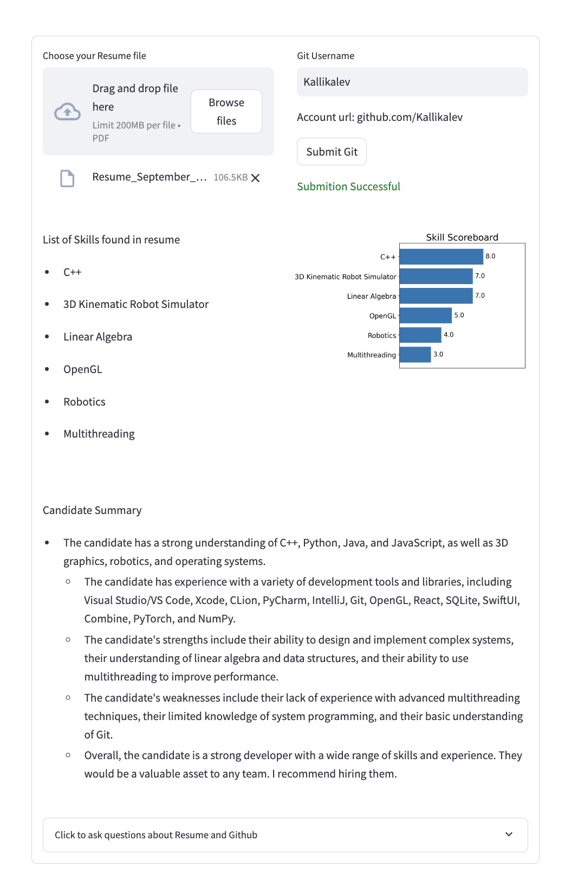
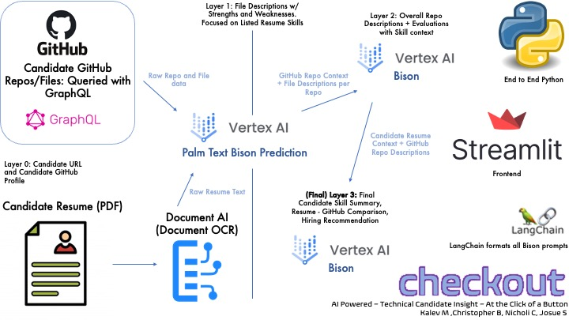

# Checkout: "Accelerated Techinical-recruiting, for non-technical recruiters"

## Overview
"Checkout" is an AI pipeline designed to enhance the recruitment process for technical roles. It allows recruiters to cross-reference software engineer candidates' resumes with their GitHub profiles. This smart tool provides a comprehensive analysis by extracting key insights from both the resume and GitHub repositories, thereby offering a more holistic view of the candidate's technical skills and project experience.

## Goal: Streamline the candidate funnel process for software roles, on a by-evidence basis.
Powered by Google's Vertex Ai and the Git API. Recruiters can quickly recieve a list of skills with scores backed by real projects hosted on github. Allowing for more accurate resume filters, faster.

## Usecase
Recruiters often have to filter through thousands of resumes to fill only a handful of positions. ATS systems help filter out resumes' based on keywords, but does not provide analytical evidence. With Checkout recruiters can autonomously filter thousands of resumes to find a best fit on a by-skill basis.

## Key Features
- **Candidate Resume Analysis**: Checkout integrates Google Document AI to analyze PDF resumes, extracting relevant details.
- **GitHub Repository Query**: Utilizes GraphQL to fetch and analyze candidate GitHub profile/repo data.
- **End to End Python**
- **Multilayered Analysis**:
    - Layer 0: Basic candidate URL and GitHub profile analysis.
    - Layer 1: File descriptions focusing on strengths and weaknesses based on listed resume skills.
    - Layer 2: Overall repository descriptions and skill-specific evaluations.
    - Layer 3: Final skill summary, a comparative analysis of the resume and GitHub, including hiring recommendations.

## How It Works
Checkout employs a combination of Document OCR for resume text extraction and Palm Text Bison Prediction for processing GitHub data. The process involves:
1. Extracting raw resume text and GitHub repo/file data.
2. Performing a layered analysis, from basic profile details to an in-depth skill assessment.
3. Concluding with a comprehensive candidate skill summary and hiring recommendation.

